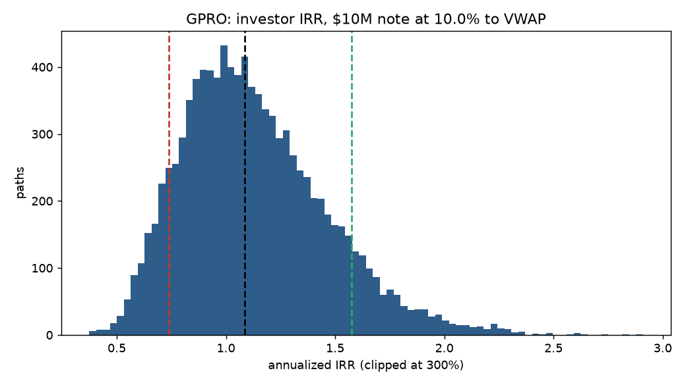
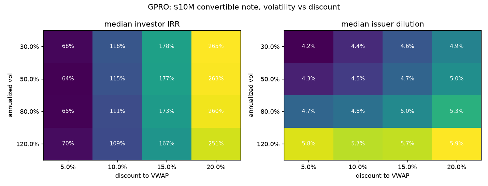

# Convertible Note & PIPE Dilution Simulator

Monte Carlo model of the two instruments behind most small-cap structured PIPE financings:

- **Variable-price convertible notes.** The investor funds principal at an original issue
  discount, then converts in tranches at a discount to the trailing VWAP and sells the shares.
  A floor price can pause conversion; unconverted principal is repaid in cash at maturity.
- **Standby equity facilities (SEPA / equity lines).** The issuer draws cash on demand and the
  investor buys newly issued shares at a discount to the pricing-period VWAP.

The question it answers: how much of the investor's return comes from the discount versus the
stock, and what does that cost the issuer in dilution, across volatility, discount, conversion
cadence, and floor-price scenarios.

I built this after a summer at a structured finance fund evaluating live PIPE positions, to put
numbers on the intuition that these deals are priced off flow and structure more than off the
stock's direction.

## Who it is for

- **Issuers.** A CFO weighing a variable-price note usually has one number in mind: the share
  count the deal "should" cost at today's price. The model replaces that single number with a
  distribution. It shows how much more dilution the issuer takes than that base case once the
  stock is volatile or the pricing period is short, and what a floor price or a longer cadence
  buys back. That is the negotiation: discount, cadence, floor, and tranche size are the levers,
  and each one has a dilution cost the issuer can now put a number on.
- **Investors.** The same instrument can be valued three ways: as a bond with a conversion
  option, as a discounted-VWAP claim on future share sales, or as the equity itself. The model
  makes the second view explicit by simulating the conversion-and-sell path, so an investor can
  compare the IRR of running the structure against simply holding the stock, and see which
  terms (discount, cadence, floor) actually drive the return and which are noise.

## What it does

1. Pulls two years of prices from Yahoo Finance, calibrates annualized realized volatility, and
   reads shares outstanding (`pipesim/calibrate.py`). Manual inputs work offline.
2. Simulates daily closes with geometric Brownian motion, zero drift (`pipesim/paths.py`).
3. Runs the conversion schedule on every path at once (`pipesim/engine.py`): on each conversion
   day the conversion price is `(1 - discount) x trailing VWAP`, floored; the investor converts
   a tranche if selling at market clears the conversion price, and sells at the close less
   slippage.
4. Solves annualized IRR per path by vectorized bisection and reports IRR percentiles, MOIC,
   probability of loss, and issuer dilution (`pipesim/metrics.py`).
5. Sweeps volatility x discount and conversion cadence x floor price (`pipesim/scenarios.py`).

## Execution model: selling is not free

The engine above assumes the investor sells every converted share at the close. `trade.py` drops
that assumption. Put in a ticker and it pulls price, volatility, shares outstanding and average
daily volume (`pipesim/market.py`), then runs the note through `pipesim/execution.py`:

- **Volume limit.** The investor sells at most `participation` of each day's volume (10% by
  default) and holds the rest as inventory. It converts only what it can sell before the next
  conversion.
- **Price impact (square-root law).** Selling q shares into daily volume V costs
  `eta x daily vol x sqrt(q / V)` on that day's fills.
- **Carried impact and recovery.** Half of that move carries past the day. Of the carried move,
  30% stays in the price for good and the rest fades with a 10-trading-day half-life, so the
  stock recovers part of the drop once the selling slows. The carried move lowers the VWAP that
  sets later conversion prices, which is how the investor's own selling raises the issuer's
  dilution.
- **Best setup.** `pipesim/optimize.py` grid-searches conversion cadence, tranche size and
  selling speed, and ranks setups by median dollar profit among those with P(loss) of 10% or less.
- **Replay.** The same note runs on the stock's actual last year of prices and volume, with the
  investor's own impact layered on top.

```
python trade.py --ticker OTLK
python trade.py --ticker GPRO --no-optimize --paths 3000
python trade.py --ticker OTLK --half-life inf        # impact never recovers
```

### Example: Outlook Therapeutics, $10M note, 10% discount, run 2026-09-28

Spot $0.64, realized vol 163%, 243.4M shares outstanding, about $9.0M of stock traded a day, so
the note is about 1.1 days of total volume.

| | Frictionless | Impact, no recovery | Impact with recovery |
|---|---|---|---|
| Median IRR | 112% | 94% | 98% |
| p10 IRR | 72% | 37% | 44% |
| Median dilution | 12.6% | 14.5% | 13.3% |
| Price drag from own selling, worst / at end | | 26% / 26% | 11% / 8% |

- **Liquidity decides how much of the discount the investor keeps.** Impact costs about 145 bps
  of every sale, and full exit takes about 160 trading days. On GoPro, which trades about
  $45M a day, impact barely moves the IRR.
- **Small and frequent beats large.** The best setup converts 5% of principal every 5 days and
  sells at 10% of volume, for about $2.6M median profit.
- **The discount carries the trade on real data too.** Replayed on the last year of actual
  prices, the stock fell 5% over the term and the note still made $2.8M (128% IRR).

## Run it

```
pip install -r requirements.txt
python run.py --ticker GPRO
python run.py --ticker LCID --principal 25e6 --discount 0.12 --floor-pct 0.5
python run.py --s0 3.20 --sigma 0.85 --shares-out 150e6      # offline
python -m pytest tests
```

## Example: GoPro, $10M note, 10% discount to 10-day VWAP, converting $1M every 10 days

Calibrated on 2026-09-03: spot $1.39, realized vol 118%, 184.5M shares outstanding.

| | p10 | p50 | p90 |
|---|---|---|---|
| Investor IRR | 74% | 109% | 158% |
| Issuer dilution | | 5.6% | 13.3% |





### What the grid shows

- **Volatility barely moves the investor's IRR.** Across 30% to 120% vol, median IRR at a
  10% discount stays near 110% to 118%. The return is a fee on flow, captured at every
  conversion, not a directional bet on the stock.
- **The discount is the whole trade.** Moving from 5% to 20% roughly quadruples IRR.
- **Volatility is the issuer's problem.** Dilution rises with vol because more conversions
  land at depressed VWAPs, so the issuer hands over more shares per dollar.
- **Cadence sets IRR, not MOIC.** Converting every 5 days versus every 21 days takes median IRR
  from about 44% to about 290% on the same cash multiple, because capital recycles faster.
  This is why these structures push for short pricing periods.
- **Floors protect the issuer at the investor's expense.** A floor at 75% of spot cuts the p10
  IRR sharply and leaves part of the note unconverted at maturity.

## Assumptions and limits

These are the things I would want to be asked about.

- **Impact parameters are placeholders, not fitted.** The square-root coefficient (0.5), the
  carried share (50%), the part that never fades (30%) and the 10-day half-life are
  textbook-scale values. None is fitted to real PIPE selling. The right calibration is a desk's
  own record of how much its selling moved a stock and how fast the price came back. Every one
  is a flag on `trade.py`, so the results can be checked across a range. The base engine in
  `run.py` still has no impact at all.
- **VWAP is a trailing mean of closes.** Simulated volume is lognormal around the average and
  independent across days; it does not rise on down days or react to the investor's selling.
- **Zero-drift GBM.** No jumps, no default, no delisting. Probability of loss is near zero here
  because every permitted conversion locks in the discount; the real loss case is the issuer
  failing before the note converts.
- **Conversion rule is mechanical.** A fixed tranche every `cadence` days when profitable. The
  execution model caps it at what can be sold before the next conversion, but there are no
  contractual daily conversion caps or ownership blockers (for example 4.99%).
- **No lookahead.** Every decision on day t uses closes and volume up to day t only, and impact
  from day t's sales reaches prices from day t+1 on, so the logic cannot leak future prices into
  past conversions. A test shocks prices after day 120 and checks that nothing before it changes.
  The replay has a separate leak: volatility and volume are calibrated on the same window it
  replays.

## Layout

```
pipesim/
  instruments.py   ConvertibleNote and StandbyEquityFacility dataclasses
  paths.py         GBM simulation and vectorized trailing VWAP
  engine.py        conversion engine, vectorized across paths
  metrics.py       IRR by bisection, summary statistics
  calibrate.py     yfinance vol and shares-outstanding calibration
  scenarios.py     volatility x discount grid, cadence x floor stress
  market.py        yfinance price, vol, shares outstanding and volume for the execution model
  execution.py     volume-limited, price-moving conversion engine with impact recovery
  optimize.py      cadence x tranche x selling-speed grid search
run.py             CLI: prints tables, writes charts to output/
trade.py           CLI: ticker in, frictionless vs execution-aware, best setup, historical replay
tests/             engine and metric sanity checks
```
